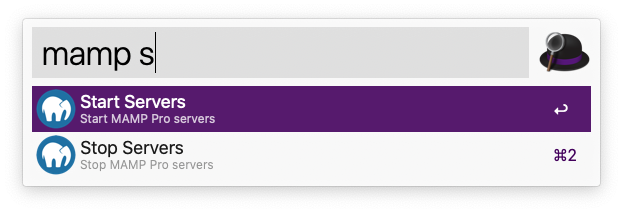

# Alfred MAMP PRO Worflow

A workflow for alfred.app to start and stop MAMP servers with a command line expression. 

## Installation and Usage

Pop over to the [Releases](https://github.com/miclgael/alfred-mamp-workflow/releases) page and download the latest binary.

Otherwise you can clone the repo and make it yourself, its ridiculously simple, just use the commands in `commands.sh`

## Caveats

1. Requires [Alfred Powerpack](https://www.alfredapp.com/powerpack/) features - (a paid upgrade)
2. [MAMP PRO](https://www.mamp.info/en/store/) (a paid upgrade) must be installed in the default location and running.
